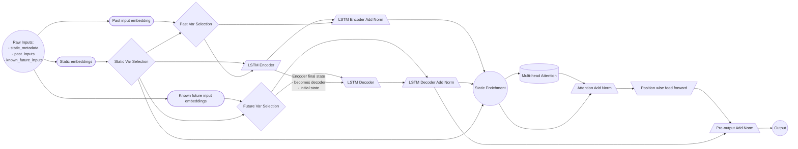
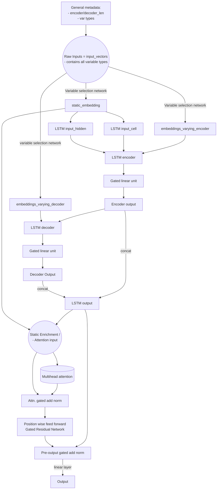

# theoretical architecture  

```mermaid

graph LR
    A((Raw Inputs:<br>- static_metadata<br>- past_inputs<br>- known_future_inputs)) --> BB([Static embeddings])
    A --> BBB([Past input embedding])
    A --> BBBB([Known future input embeddings])
    BB --> C{Static Var Selection}
    BBB --> CC{Past Var Selection}
    BBBB --> CCC{Future Var Selection}
    C --> CC
    C --> CCC
    C ---> D[/LSTM Encoder/]
    CC --> D
    CCC --> E[\LSTM Decoder\]
    D -->|Encoder final state <br>- becomes decoder <br>- initial state| E
    D --> F[/LSTM Encoder Add Norm\]
    CC --> F
    F --> G((Static Enrichment))
    CCC --> FF[/LSTM Decoder Add Norm\]
    E --> FF
    FF --> G
    C --> G
    G --> H[(Multi-head Attention)]
    H --> I[/Attention Add Norm\]
    G --> I
    I --> J[\Position wise feed forward/]
    J --> K[/Pre-output Add Norm\]
    FF --> K
    K --> L((Output))

```

# implementation architecture  

```mermaid

graph TD
    %% Input, embeddings and variable selection
    A[General metadata: <br>- encoder/decoder_len <br>- var types] --> B
    B((Raw Inputs = input_vectors <br>- contains all variable types)) -->|Variable selection network| C[static_embedding]
    D[embeddings_varying_encoder]
    B --> |Variable selection network|D
    E[embeddings_varying_decoder]
    B --> |variable selection network|E

    %% LSTM
    F[LSTM input_hidden]
    G[LSTM input_cell]
    C --> F
    C --> G

    %% encoder
    H[LSTM encoder]
    F --> H
    G --> H
    D --> H
    II[Gated linear unit]
    I[Encoder output]
    H --> II
    II --> I
    %% decoder
    J[LSTM decoder]
    E --> J
    I --> J
    K[Decoder Output]
    KK[Gated linear unit]
    J --> KK
    KK --> K 
    KKK[LSTM output]
    K -->|concat| KKK
    I -->|concat| KKK

    %% Static Enrichment
    L((Static Enrichment /<br>- Attention input))
    C --> L
    KKK --> L

    %% attention
    M[(Multihead attention)] 
    L --> M
    NN[Position wise feed forward<br>Gated Residual Network]
    NNN[Attn. gated add norm]
    L --> NNN
    N[Pre-output gated add norm]
    M --> NNN
    NNN --> NN
    NN --> N
    KKK --> N

    %% output
    O[Output]
    N --> |linear layer|O
```

 