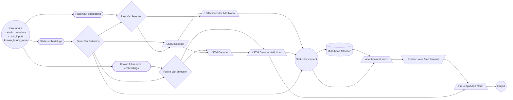

# implementation architecture  

```mermaid

graph LR
    A((Raw Inputs:<br>- static_metadata<br>- past_inputs<br>- known_future_inputs)) --> BB([Static embeddings])
    A --> BBB([Past input embedding])
    A --> BBBB([Known future input embeddings])
    BB --> C{Static Var Selection}
    BBB --> CC{Past Var Selection}
    BBBB --> CCC{Future Var Selection}
    C --> CC
    C --> CCC
    C ---> D[/LSTM Encoder/]
    CC --> D
    CCC --> E[\LSTM Decoder\]
    D --> E
    D --> F[/LSTM Encoder Add Norm\]
    CC --> F
    F --> G((Static Enrichment))
    CCC --> FF[/LSTM Decoder Add Norm\]
    E --> FF
    FF --> G
    C --> G
    G --> H[(Multi-head Attention)]
    H --> I[/Attention Add Norm\]
    G --> I
    I --> J[\Position wise feed forward/]
    J --> K[/Pre-output Add Norm\]
    FF --> K
    K --> L((Output))

```