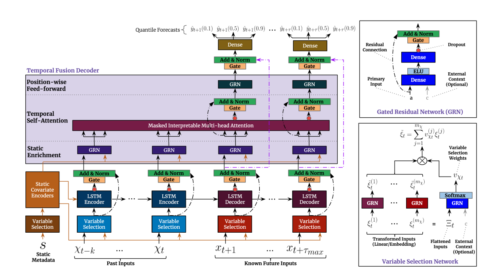
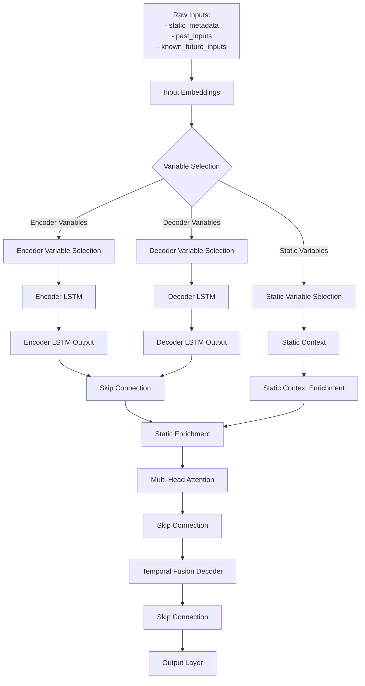

# implementation architecture  

```mermaid

graph TD
    A[Raw Inputs:<br>- static_metadata<br>- past_inputs<br>- known_future_inputs] --> B[Input Embeddings]
    B --> C{Variable Selection}
    C -->|Static Variables| D[Static Variable Selection]
    C -->|Encoder Variables| E[Encoder Variable Selection]
    C -->|Decoder Variables| F[Decoder Variable Selection]
    D --> G[Static Context]
    E --> H[Encoder LSTM]
    F --> I[Decoder LSTM]
    G --> J[Static Context Enrichment]
    H --> K[Encoder LSTM Output]
    I --> L[Decoder LSTM Output]
    K --> M[Skip Connection]
    L --> M
    M --> N[Static Enrichment]
    J --> N
    N --> O[Multi-Head Attention]
    O --> P[Skip Connection]
    P --> Q[Temporal Fusion Decoder]
    Q --> R[Skip Connection]
    R --> S[Output Layer]

```

